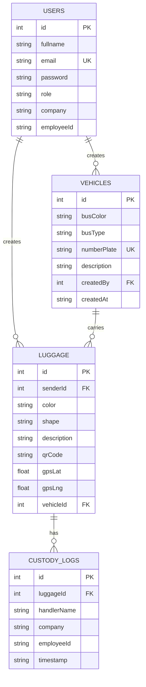

# Cargo Tracking System - ER Diagram (Mermaid)

## Database Schema Summary

### Tables and Their Purposes

1. **USERS** - User authentication and role management
2. **VEHICLES** - Bus/vehicle information and tracking
3. **LUGGAGE** - Luggage items with tracking capabilities
4. **CUSTODY_LOGS** - Handler activity and custody tracking

### Key Features

- **User Roles**: Senders create luggage, Handlers scan QR codes
- **Vehicle Tracking**: Detailed bus information with unique plates
- **GPS Tracking**: Real-time location updates for luggage
- **QR Code System**: Unique identifiers for each luggage item
- **Custody Management**: Complete audit trail of luggage handling

### Relationships

- **1:N** - One user can create multiple luggage items
- **1:N** - One user can create multiple vehicles
- **1:N** - One vehicle can carry multiple luggage items
- **1:N** - One luggage can have multiple custody logs 