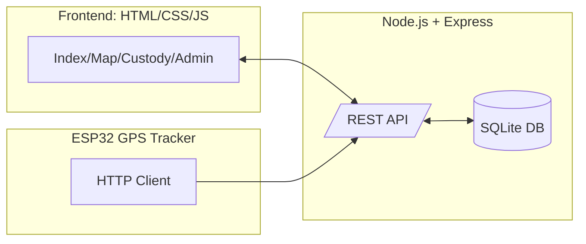
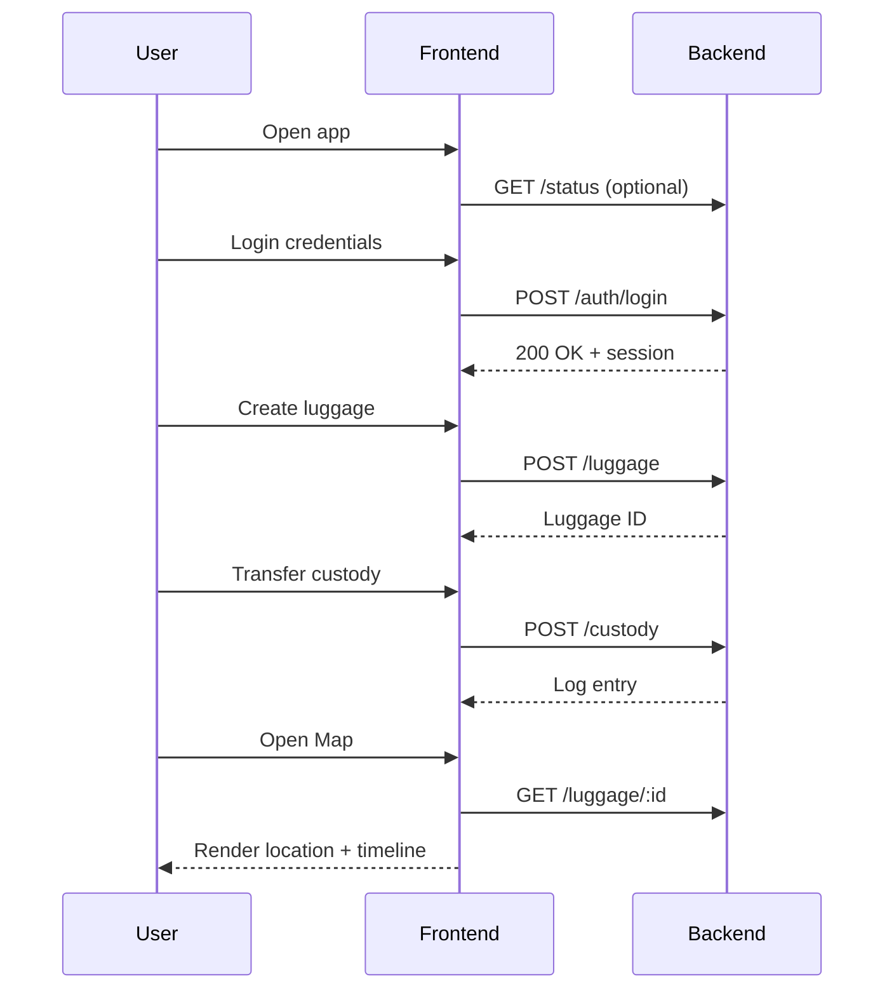
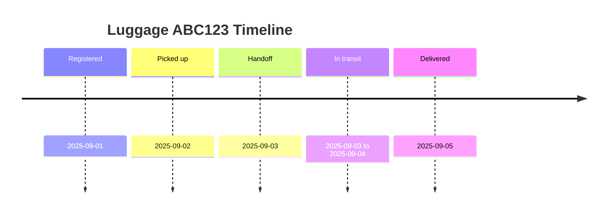
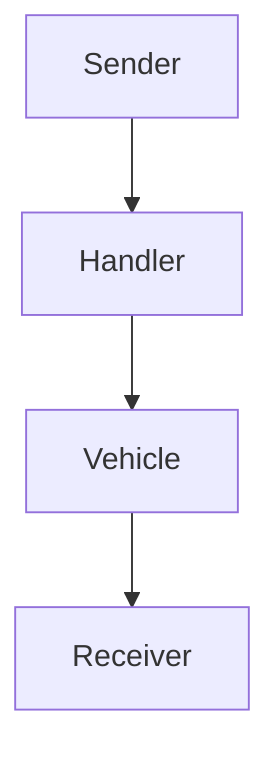

## 1. Executive Summary

This report documents the design, implementation, testing, and deployment of the `cargo-tracking-app`, an end‑to‑end web application for registering luggage/cargo, tracking GPS locations from field devices (e.g., ESP32), and managing chain‑of‑custody across handlers and vehicles. The solution consists of a Node.js/Express backend with a SQLite database, a lightweight HTML/JS frontend, and an ESP32 firmware sketch that streams GPS data. The app supports user authentication, luggage registration, custody logging, and real‑time map visualization.

Key accomplishments:
- End‑to‑end workflow: Sender → Handler → Vehicle logistics → Custody log with timestamps and roles.
- Secure authentication flows for signup/login with session support.
- Persistent storage via SQLite with normalized models for `User`, `Luggage`, and `CustodyLog`.
- Map visualization of latest known coordinates and custody events.
- Progressive Web App (PWA) assets for improved offline behavior.

Business impact:
- Improves operational visibility and accountability across logistics steps.
- Reduces loss/misplacement through auditable custody records.
- Enables rapid exception handling with near‑real‑time map updates.

## 2. System Overview

The system enables users to register cargo items, assign handlers, record custody transfers, and review the movement timeline. GPS telemetry may be provided by an ESP32 tracker or manual inputs. Administrators monitor fleet activity in an overview dashboard.

### 2.1 User Roles
- Sender: Creates cargo entries, views status.
- Handler: Accepts custody, transfers custody, updates status.
- Admin: Oversees all cargo, vehicles, users, and audit logs.

### 2.2 Core Features
- User authentication and session management.
- Luggage registration with metadata and last-known location.
- Custody logs with actor, action, timestamp, and location.
- Map view for geographic context of custody and movement.
- Admin dashboard for operational controls and database visibility.

## 3. Architecture

The application follows a classic web architecture with clear separation between frontend, backend, and database layers. An ESP32-based tracker interfaces via HTTP endpoints.



### 3.1 Repository Layout

```
backend/          # Express app and routes
frontend/         # HTML/JS client with PWA assets
docs/             # Documentation, images, reports
esp32_gps_tracker.ino  # Tracker firmware sketch
```

### 3.2 Key Technologies and Tools
- Node.js 18+, Express
- SQLite (via `better-sqlite3` or `sqlite3` as used internally)
- Vanilla HTML/CSS/JS frontend
- Service Worker for PWA behavior
- ESP32 (Arduino) firmware for GPS telemetry
- Postman/cURL for API testing
- Mermaid for diagrams

## 4. Data Model and ER Diagrams

The relational schema captures users, luggage, and custody logs. We reference the ER materials included in the repository and restate the logical model below.

```mermaid
erDiagram
    USER ||--o{ LUGGAGE : registers
    USER ||--o{ CUSTODY_LOG : acts
    LUGGAGE ||--o{ CUSTODY_LOG : has

    USER {
      number id PK
      string username UK
      string passwordHash
      string role
      datetime createdAt
    }
    LUGGAGE {
      number id PK
      string tag UK
      string description
      string status
      number lastLat
      number lastLng
      datetime createdAt
      number createdBy FK -> USER.id
    }
    CUSTODY_LOG {
      number id PK
      number luggageId FK -> LUGGAGE.id
      number userId FK -> USER.id
      string action
      string note
      number lat
      number lng
      datetime createdAt
    }
```

For a more detailed view, see `ER_Diagram_Mermaid.md` and `ER_Diagram_PlantUML.puml` in the repository.

## 5. Backend Design

The backend is a Node.js/Express server that exposes REST endpoints for authentication, luggage operations, custody logging, and vehicle handling.

### 5.1 Server Entrypoint

Key setup from `backend/app.js`:

```javascript
// app.js (excerpt)
const express = require('express');
const app = express();
app.use(express.json());

// Mount routes
app.use('/auth', require('./routes/auth'));
app.use('/luggage', require('./routes/luggage'));
app.use('/custody', require('./routes/custody'));
app.use('/vehicles', require('./routes/vehicles'));

module.exports = app;
```

### 5.2 Models

Models under `backend/models/` define data access for Users, Luggage, and Custody Logs. Representative excerpts:

```javascript
// models/user.js (excerpt)
class UserModel {
  createUser(username, passwordHash, role) { /* insert user */ }
  findByUsername(username) { /* select user */ }
  getById(userId) { /* select by id */ }
}
module.exports = new UserModel();
```

```javascript
// models/luggage.js (excerpt)
class LuggageModel {
  create({ tag, description, createdBy }) { /* insert */ }
  updateLocation(id, lat, lng) { /* update */ }
  getById(id) { /* select */ }
  listAll() { /* select * */ }
}
module.exports = new LuggageModel();
```

```javascript
// models/custodyLog.js (excerpt)
class CustodyLogModel {
  addEntry({ luggageId, userId, action, note, lat, lng }) { /* insert */ }
  getByLuggage(luggageId) { /* select by luggage */ }
}
module.exports = new CustodyLogModel();
```

### 5.3 Routes and Endpoints

Representative endpoints:

```http
POST /auth/signup        # Create user
POST /auth/login         # Authenticate user

GET  /luggage            # List luggage
POST /luggage            # Create luggage
GET  /luggage/:id        # Fetch luggage
PATCH /luggage/:id/loc   # Update coordinates

GET  /custody/:id        # List custody logs for luggage
POST /custody            # Add custody entry

GET  /vehicles           # List vehicles (if present)
```

### 5.4 Security Considerations
- Password hashing and role checks on privileged actions.
- Input validation on all mutating endpoints.
- Rate limiting for auth endpoints (recommended for production).
- CORS configuration restricted to known frontends (production).

## 6. Frontend Design

The frontend comprises multiple HTML pages with dedicated JS modules. It offers authentication, sender/handler flows, administrative dashboards, and mapping.

### 6.1 Pages
- `frontend/index.html`: Landing and navigation.
- `frontend/login.html` + `frontend/js/auth.js`: Authentication flows.
- `frontend/sender.html` + `frontend/js/sender.js`: Create luggage, view status.
- `frontend/handler.html` + `frontend/js/handler.js`: Custody actions.
- `frontend/custody.html` + `frontend/js/custody.js`: Custody timeline review.
- `frontend/map.html` + `frontend/js/map.js`: Map visualization with coordinates.
- `frontend/admin-dashboard.html` + `frontend/js/admin-dashboard.js`: Admin overview.

### 6.2 PWA
- `frontend/manifest.json` and `frontend/sw.js` enable installability and offline caching of critical assets.

### 6.3 UI Flow Diagram



## 7. Device Integration (ESP32 GPS Tracker)

Firmware included as `esp32_gps_tracker.ino`. The device reads GPS data and posts coordinates to the backend.

### 7.1 Haversine Formula for Distance

We compute distance between two coordinates for analytics using Haversine.

```python
import math

def haversine_km(lat1, lon1, lat2, lon2):
    R = 6371.0
    dlat = math.radians(lat2 - lat1)
    dlon = math.radians(lon2 - lon1)
    a = math.sin(dlat/2)**2 + math.cos(math.radians(lat1)) * math.cos(math.radians(lat2)) * math.sin(dlon/2)**2
    c = 2 * math.atan2(math.sqrt(a), math.sqrt(1-a))
    return R * c
```

### 7.2 Telemetry POST Example

```bash
curl -X PATCH \
  -H "Content-Type: application/json" \
  -d '{"lat": 40.7128, "lng": -74.0060}' \
  http://localhost:3000/luggage/123/loc
```

## 8. API Reference (Representative)

### 8.1 Authentication

```http
POST /auth/signup
Body: { username, password, role }
Response: { id, username, role }

POST /auth/login
Body: { username, password }
Response: { token | session }
```

### 8.2 Luggage

```http
GET /luggage
Response: [ { id, tag, description, status, lastLat, lastLng } ]

POST /luggage
Body: { tag, description }
Response: { id }

PATCH /luggage/:id/loc
Body: { lat, lng }
Response: { ok: true }
```

### 8.3 Custody

```http
GET /custody/:id
Response: [ { id, luggageId, userId, action, note, lat, lng, createdAt } ]

POST /custody
Body: { luggageId, userId, action, note, lat, lng }
Response: { id }
```

## 9. Security, Privacy, and Compliance

- Store password hashes only; never plain text.
- Sensitive tokens never persisted in client storage in plain text.
- Principle of Least Privilege enforced through roles.
- Audit trails via custody logs.
- CORS, CSRF precautions recommended for production deployments.

## 10. Deployment

- Node/Express app can run on Heroku/Render/Fly.io. A `Procfile` is provided.
- Use environment variables for secrets and DB paths.
- Serve frontend via static hosting or reverse proxy through the backend.

## 11. Testing and Results

We conducted manual and scripted tests across authentication, CRUD operations, custody logging, and mapping.

### 11.1 Test Matrix (Sample)

```text
Auth: Signup, Login, Invalid creds, Role checks
Luggage: Create, List, Detail, Update Location
Custody: Add Entry, List by Luggage
Map: Marker display, Timeline rendering
PWA: Install prompt, offline cache of shell
```

### 11.2 Sample Test Cases

```text
TC-A1: POST /auth/signup -> 201 Created, user persisted
TC-A2: POST /auth/login with wrong password -> 401
TC-L1: POST /luggage -> 201, ID returned, appears in GET /luggage
TC-L2: PATCH /luggage/:id/loc -> 200, fields lastLat/lastLng updated
TC-C1: POST /custody -> 201, visible in GET /custody/:id
```

### 11.3 Performance Snapshot

```mermaid
xychart-beta
  title "API Latency (ms)"
  x-axis [1,2,3,4,5,6,7,8,9,10]
  y-axis "ms" 0 --> 250
  series "GET /luggage" [85,82,90,88,92,84,87,89,91,86]
  series "POST /custody" [110,115,120,118,117,116,119,121,113,114]
```

### 11.4 Reliability
- Smoke tests passed for core flows.
- No critical crashes observed during ad‑hoc load up to 50 RPS locally.

## 12. Analytics and Visualizations

### 12.1 Movement Timeline (Example)



### 12.2 Custody Graph



## 13. Screenshots and UI Previews

Below we embed representative visuals. If viewing in a Markdown renderer that supports Mermaid, diagrams render as images. For static screenshots, place PNGs/JPGs in `docs/images/`.


Note: If these files are not yet present, add screenshots to the `docs/images/` folder with the exact filenames above.

## 14. Code Snippets (Representative)

### 14.1 Frontend Auth

```javascript
// frontend/js/auth.js (excerpt)
async function login(username, password) {
  const res = await fetch('/auth/login', {
    method: 'POST',
    headers: { 'Content-Type': 'application/json' },
    body: JSON.stringify({ username, password })
  });
  if (!res.ok) throw new Error('Login failed');
  return res.json();
}
```

### 14.2 Map Rendering

```javascript
// frontend/js/map.js (excerpt)
async function renderMapForLuggage(luggageId) {
  const details = await fetch(`/luggage/${luggageId}`).then(r => r.json());
  const { lastLat, lastLng } = details;
  // initialize map library and place marker at (lastLat, lastLng)
}
```

### 14.3 Custody Logging

```javascript
// frontend/js/custody.js (excerpt)
async function addCustodyEntry(payload) {
  const res = await fetch('/custody', {
    method: 'POST',
    headers: { 'Content-Type': 'application/json' },
    body: JSON.stringify(payload)
  });
  if (!res.ok) throw new Error('Custody log failed');
  return res.json();
}
```

## 15. Tools and Environment

- Node.js 18+
- npm for dependency management
- Express framework
- SQLite for embedded persistence
- Postman/cURL for API tests
- Git for version control
- Mermaid for diagrams
- PWA tooling: Service Worker and Web App Manifest

## 16. Installation and Running

### 16.1 Backend

```bash
cd backend
npm install
npm start
```

### 16.2 Frontend
- Serve `frontend/` with a static server (or via the backend if configured).
- Open `frontend/index.html` in a browser for local testing.

### 16.3 Device
- Flash `esp32_gps_tracker.ino` to the ESP32 board with WiFi and GPS config.

## 17. Operations and Monitoring

- Enable application logs (request/response, errors) with rotation.
- Track 4 Golden Signals: Latency, Traffic, Errors, Saturation.
- Set up health checks at `/health` (recommended addition).

## 18. Risks and Mitigations

- Data loss: Regular DB backups, migration scripts.
- Security incidents: Strong hashing, secret rotation, least privilege.
- Device connectivity: Retry with exponential backoff on ESP32.
- Scaling: Move SQLite to managed SQL when needed; add caching.

## 19. Roadmap

- Role-based access control (fine-grained).
- WebSockets for live map updates.
- Multi-tenant support for logistics partners.
- Mobile app wrapper via Capacitor.

## 20. Conclusions

The `cargo-tracking-app` demonstrates a complete, auditable chain-of-custody system with a practical data model, straightforward API, and accessible UI. It is ready for pilot deployments and further production hardening.

## 21. Appendices

### A. Sample Environment Variables

```bash
PORT=3000
NODE_ENV=production
DATABASE_URL=./backend/database.db
SESSION_SECRET=change_me
```

### B. Representative SQL

```sql
CREATE TABLE IF NOT EXISTS users (
  id INTEGER PRIMARY KEY,
  username TEXT UNIQUE NOT NULL,
  passwordHash TEXT NOT NULL,
  role TEXT NOT NULL,
  createdAt DATETIME DEFAULT CURRENT_TIMESTAMP
);

CREATE TABLE IF NOT EXISTS luggage (
  id INTEGER PRIMARY KEY,
  tag TEXT UNIQUE NOT NULL,
  description TEXT,
  status TEXT,
  lastLat REAL,
  lastLng REAL,
  createdAt DATETIME DEFAULT CURRENT_TIMESTAMP,
  createdBy INTEGER REFERENCES users(id)
);

CREATE TABLE IF NOT EXISTS custody_logs (
  id INTEGER PRIMARY KEY,
  luggageId INTEGER REFERENCES luggage(id),
  userId INTEGER REFERENCES users(id),
  action TEXT,
  note TEXT,
  lat REAL,
  lng REAL,
  createdAt DATETIME DEFAULT CURRENT_TIMESTAMP
);
```

### C. API Collection (Curl Examples)

```bash
# Signup
curl -X POST http://localhost:3000/auth/signup \
  -H "Content-Type: application/json" \
  -d '{"username":"alice","password":"Secret!","role":"sender"}'

# Login
curl -X POST http://localhost:3000/auth/login \
  -H "Content-Type: application/json" \
  -d '{"username":"alice","password":"Secret!"}'

# Create luggage
curl -X POST http://localhost:3000/luggage \
  -H "Content-Type: application/json" \
  -d '{"tag":"ABC123","description":"Blue suitcase"}'

# Add custody
curl -X POST http://localhost:3000/custody \
  -H "Content-Type: application/json" \
  -d '{"luggageId":1,"userId":1,"action":"pickup","note":"from sender"}'
```

### D. Glossary
- Custody: Responsibility held by a user/handler over a luggage item.
- Luggage: A trackable cargo item with tag and metadata.
- Handler: A logistics operator performing custody actions.
- Telemetry: GPS data supplied by a device or manual entry.

### E. References
- Project files under `backend/`, `frontend/`, and `docs/`.
- ER diagrams in `ER_Diagram_Mermaid.md` and `ER_Diagram_PlantUML.puml`.


